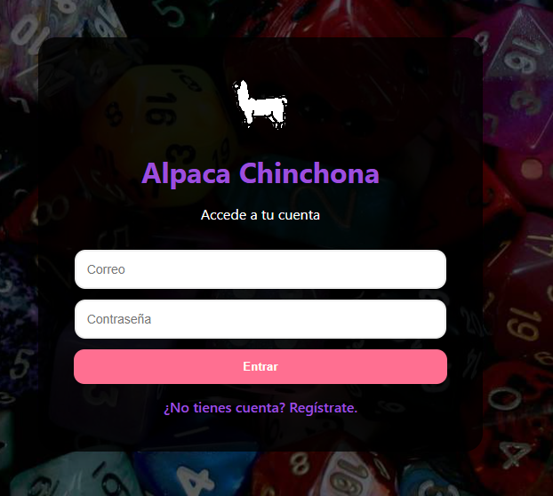
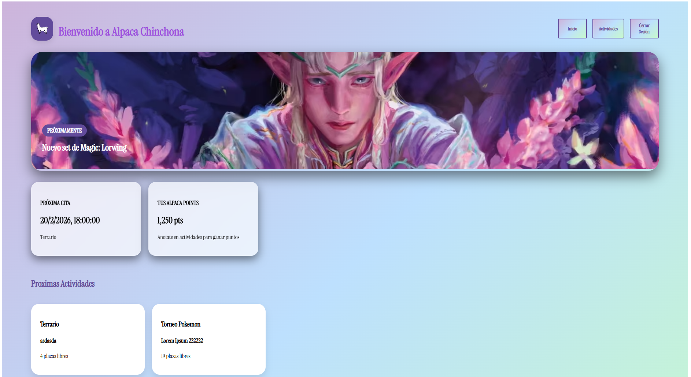
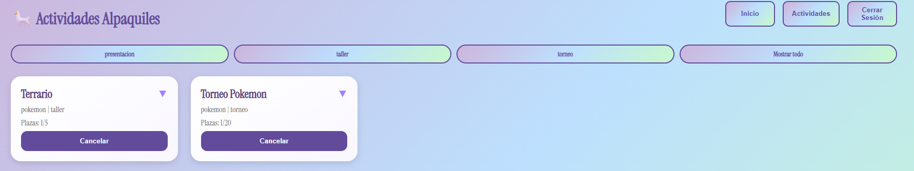
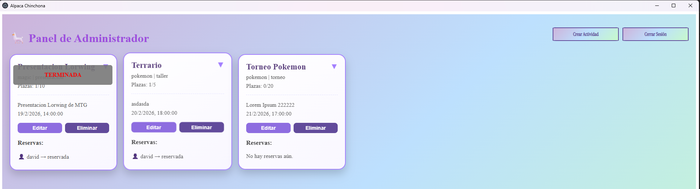
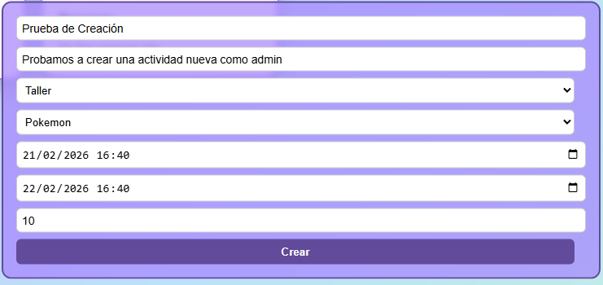
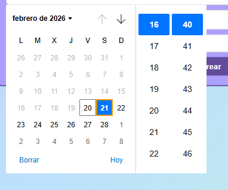
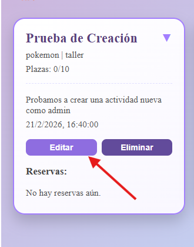
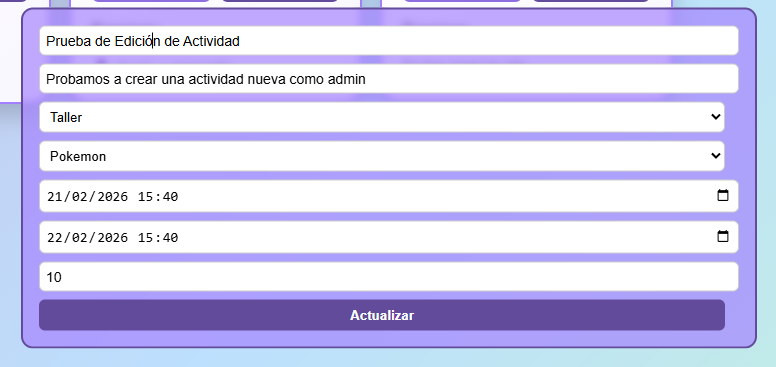
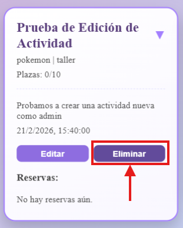
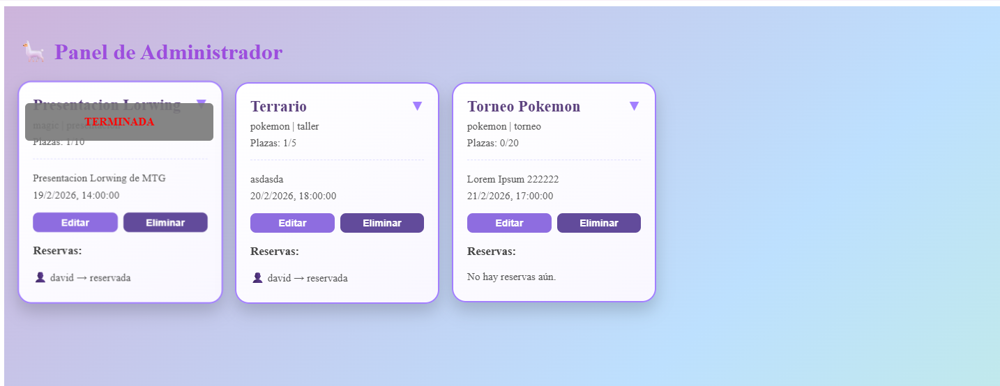

# ALPACA CHINCHONA

En esta aplicación vamos he creado una aplicación la cual gestiones las diferentes actividades de una tienda de juegos de mesa y TCG's (Juegos de Cartas Coleccionables) en la cual se hacen diferentes actividades a lo largo de la semana, algunas de estas actividades pueden ser:

- Torneos de Cartas.
- Partidas de Warhammer 40.000.
- Mesas de Rol en Vivo.
- Talleres de artesanias como hacer tu propio terrario.

## Tecnologías

Para esta parte del proyecto he usado varias tecnologías las cuales he puesto en común para crear una aplicacón completa, robusta además de bonita y funcional. Las tecnologías que he utilizado son:

- Electron: Plataforma para crear aplicaciones de escritorio usando Chromium y Node.js
- Vue: Framework basado en JS para la construcción de interfaces.
- Vite: Herramienta de construcción rapida usada por Vue.JS
- Vue Router: Librería de Enrutamiento para gestionar rutas y vistas en la app de Vue.
- Pinia: Gestión de estado para Vue 3
- Axios: Cliente HTTP para realizar peticiones a la API.
- MongoDB: Base de Datos no Relacional donde guardamos nuestros datos.
- Bcryptjs: Librería para hashear y verificar contraseñas con Node.js

## Vista de la Aplicación

### Login

### Registro

Simplemente dandole a registro nos mostrara el formulario para poder resgistrarse en la aplicación.

### Dashboard

### Las actividades vista Usuario.

En la cual podemos reservar o cancelar esta misma en las actividades disponibles para el usuario, siempre y cuando haya plazas libres. Además en caso de reservar y cancelar antes de los 15 minutos previos al inciar la actividad la reserva se cancela y la plaza se reserva. Por otro lado si se cancela la reserva después de esos 15 minutos antes, la plaza no se libera y el usuario aparece como no presentado.

### Log Out - Cerar Sesión

Al pulsar al botón cerraremos la sesión y nos devolverá al Login.

### Login como Administrador.

En este caso iniciaremos sesión como administrador para ello usaremos las credenciales del mismo **admin@example.com** el cual en la base de datos tiene el role de **admin** con lo cual en el momento de inciar sesión al comprobarse su rol nos llevará automaticamente al panel de admin.

Donde podemos ver las actividades terminadas y las cuales están en curso donde podemos crear diferentes actividades, editarlas y eliminarlas.

### Gestión de actividades por el Admin

#### Crear actividad

Ojo cuidao cuando creamos actividad:

#### Editamos fecha

Ahora procederemos a editar la actividad hecha:

Ahora se nos abrirá el mismo formulario que a la hora de crear la actividad pero en este caso ya completamente rellenado listo para cambiar los datos que queramos y darle a actualizar.

#### Actualizamos la Actividad

Con esto nuestra actividad estará actualizada y lo podremos comprobar porque nada más le demos al botón de actualizar del formulario se recargaran las actividades y podremos ver que la actividad está actualizada.

Por último solo nos quedaría por ver si podemos eliminar una actividad para ello lo que tendremos que hacer es clicar en la botón de eliminar:

#### Borramos la Actividad

Después de darle a "Eliminar" nos aparecerá un modal que nos indicará si realmente queremos eliminar la actividad en caso de darle a aceptar se nos borrará.

Con esto hemos visto todas nuestras funcionalidades de nuestra aplicación ahora vamos a mostraros un Diagrama de Caso de Uso para ver de una manera mas detallada y comoda como se comporta la aplicación y como es la comunicación del frontend con el servidor.

## Diagrama de casos de Uso

En el cual vamos a realizar el Diagrama de Casos de Uso en relación con el incio de sesión de nuestra aplicación:

Donde podemos ver dos diagramas de casos de usos donde podemos ver el diagrama de inicio de sesión y diagrama de reserva de las actividades.
